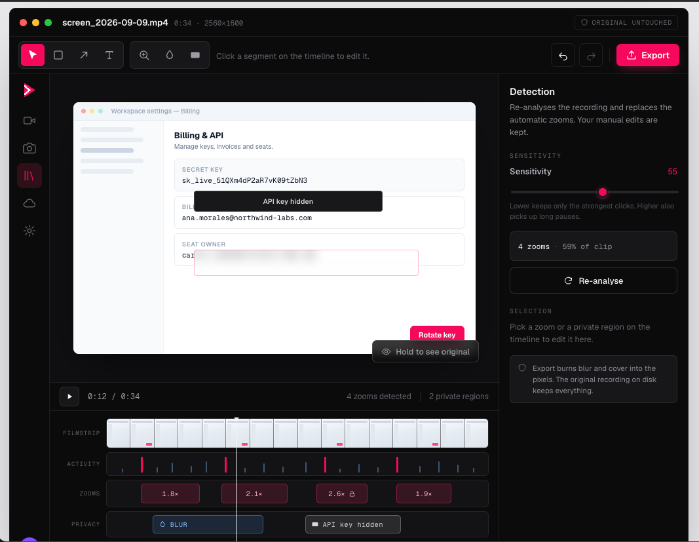
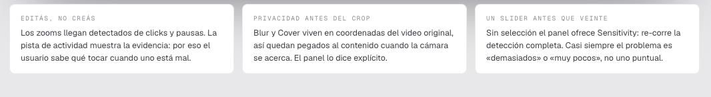
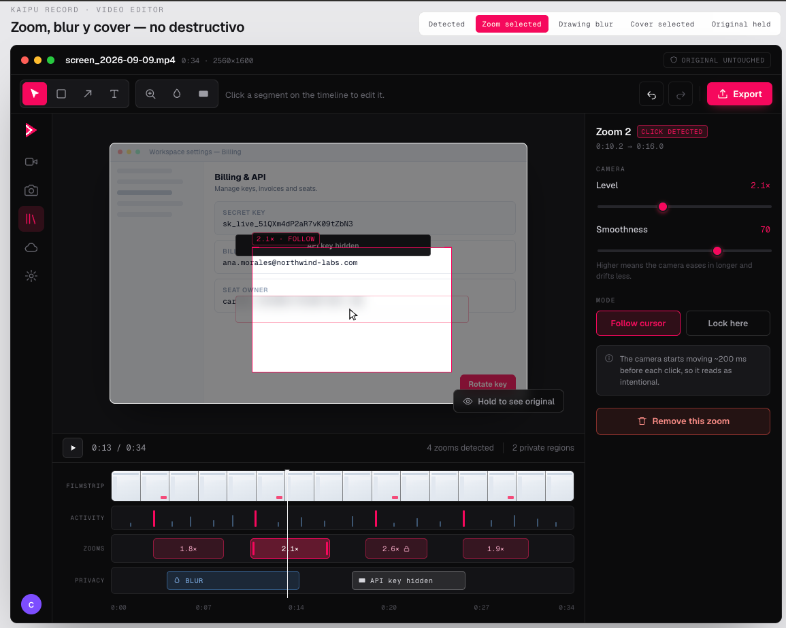
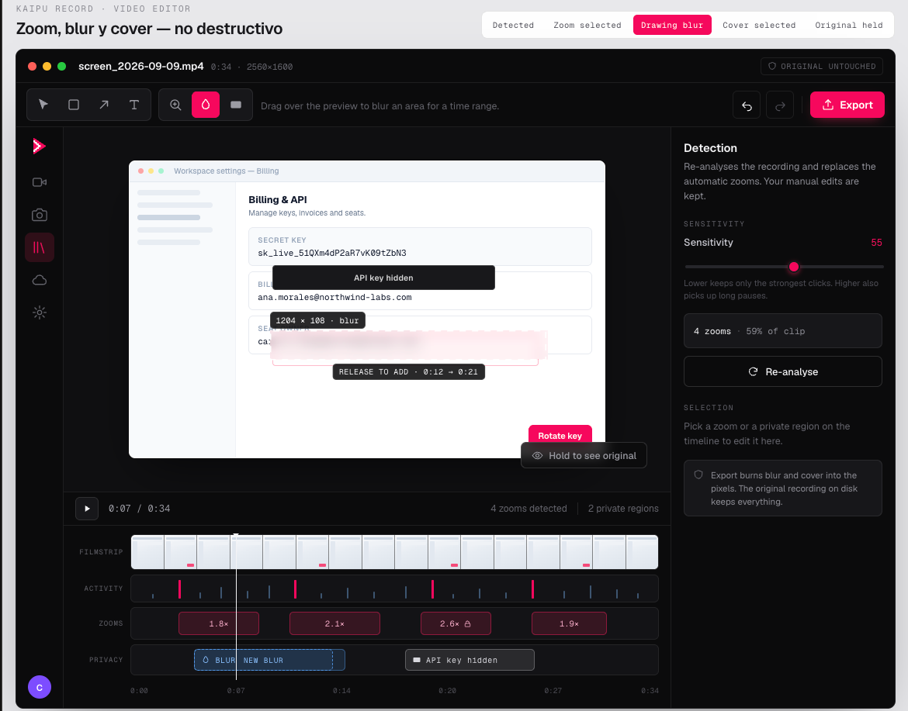
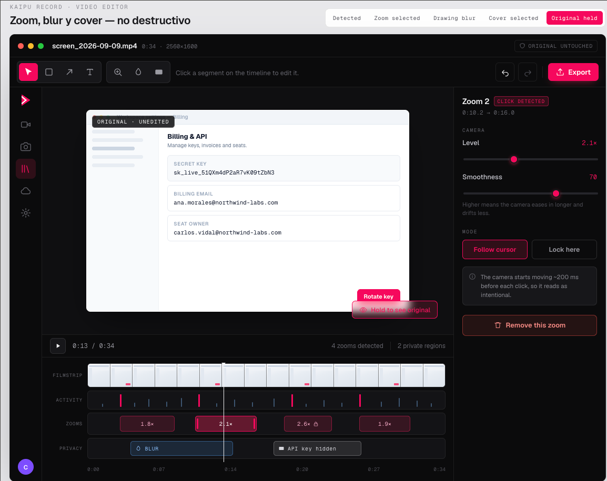
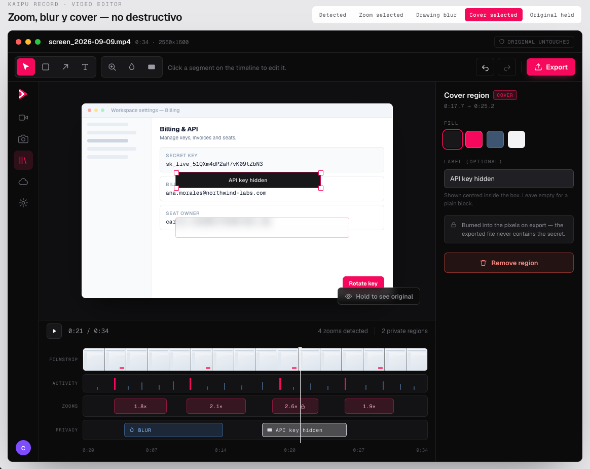

# Video editor — zoom, blur and cover

> **Status: 🔵 Proposed design** (2026-09-21). Nothing implemented yet. This is the UI
> counterpart of the [zoom cursor-follow pipeline spec](/specs/2026-09-21-zoom-cursor-follow-design/)
> and an evolution of the shipped [video editor](/specs/2026-07-03-video-editor-design/)
> timeline. Tracked in [backlog/video-editor-zoom-blur-cover](/backlog/video-editor-zoom-blur-cover/).

New screen. Edits an existing recording: adjust the zooms the system detected
automatically and hide whatever cannot be published.

- **Design file:** `Kaipu Video Editor.dc.html` (owner's design tool; not in the repo)
- **Reference window:** 1240 × 776 px · dark theme only for now
- **Model:** non-destructive — the original recording is never touched; exporting
  produces a new file.



Three principles the design is built on:



1. **You edit, you don't create.** Zooms arrive detected from clicks and pauses. The
   activity track shows the evidence, so the user knows what to touch when one is wrong.
2. **Privacy before the crop.** Blur and Cover live in original-video coordinates, so
   they stay glued to the content when the camera zooms in. The panel says so explicitly.
3. **One slider instead of twenty.** With nothing selected the panel offers Sensitivity,
   which re-runs the whole detection. The problem is almost always "too many" or "too
   few", not one specific zoom.

## 1. Anatomy

```
┌──────────────────────────────────────────────────────────────┐
│ ● ● ●   screen_2026-09-09.mp4   0:34 · 2560×1600   [ORIGINAL] │  titlebar 42
├──────────────────────────────────────────────────────────────┤
│ [select rect arrow text] [zoom blur cover]  hint   ↺ ↻ │Export│  toolbar 56
├────┬──────────────────────────────────────────┬──────────────┤
│    │                                          │              │
│rail│              preview 612×382             │  properties  │
│ 60 │                        [Hold to see orig]│     288      │
│    ├──────────────────────────────────────────┤              │
│    │ ▶  0:11 / 0:34   4 zooms · 2 regions     │              │  transport 42
│    ├──────────────────────────────────────────┤              │
│    │ FILMSTRIP ▓▓▓▓▓▓▓▓▓▓▓▓▓▓▓▓               │              │
│    │ ACTIVITY  ▁▃▁█▁▂▅▁█▁▂▃▁█▁                │              │
│    │ ZOOMS     ▓▓▓  ▓▓▓▓  ▓▓  ▓▓▓             │              │
│    │ PRIVACY   ░░░░░      ▒▒▒▒                │              │
│    │ 0:00      0:07      0:14      0:20   0:34│              │
└────┴──────────────────────────────────────────┴──────────────┘
```

| Zone      | Height | Role                                            |
| --------- | ------ | ----------------------------------------------- |
| Titlebar  | 42     | File identity and the non-destructive guarantee |
| Toolbar   | 56     | Tools, contextual hint and global actions       |
| Rail      | —      | App navigation (Library active)                 |
| Preview   | 426    | Editing and comparison canvas                   |
| Transport | 42     | Playback and counts                             |
| Timeline  | ~200   | Four tracks + ruler + playhead                  |
| Panel     | 634    | Properties of the current selection             |

## 2. Titlebar

| Element                     | Detail                                                                                                |
| --------------------------- | ----------------------------------------------------------------------------------------------------- |
| Traffic lights              | Decorative, macOS.                                                                                    |
| Name                        | `screen_2026-09-09.mp4` in Geist 13.5 semibold.                                                       |
| Metadata                    | `0:34 · 2560×1600` in Geist Mono 11, dimmed.                                                          |
| `"ORIGINAL UNTOUCHED"` pill | Shield icon + mono 10 text. Not interactive. Reminds that nothing done here modifies the source file. |

## 3. Toolbar

### 3.1 Tool groups

Two visually separated groups, each in its own bordered container.

**Group 1 — annotations**

| Button    | Icon           | Suggested shortcut | Action                             |
| --------- | -------------- | ------------------ | ---------------------------------- |
| Select    | cursor         | `V`                | Select and move existing elements. |
| Rectangle | square         | `R`                | Draw an annotation rectangle.      |
| Arrow     | diagonal arrow | `A`                | Draw an arrow.                     |
| Text      | letter T       | `T`                | Place text over the video.         |

**Group 2 — camera and privacy**

| Button | Icon               | Suggested shortcut | Action                          |
| ------ | ------------------ | ------------------ | ------------------------------- |
| Zoom   | magnifier with `+` | `Z`                | Add or re-aim a zoom segment.   |
| Blur   | drop               | `B`                | Blur an area over a time range. |
| Cover  | solid rectangle    | `C`                | Hide an area completely.        |

The Blur drop is **the same icon and the same behavior** as in the screenshot editor:
consistency across the two editors.

**Button states:** rest (grey icon `#9b9ba3`, transparent background), hover (light
icon), active (`#F6055C` background, white icon). 36 × 34 px, radius 6.

### 3.2 Contextual hint

One-line text to the right of the tools; changes with the selected tool:

| Tool      | Text                                                        |
| --------- | ----------------------------------------------------------- |
| Select    | `"Click a segment on the timeline to edit it."`             |
| Rectangle | `"Drag on the preview to draw a rectangle."`                |
| Arrow     | `"Drag on the preview to draw an arrow."`                   |
| Text      | `"Click on the preview to place text."`                     |
| Zoom      | `"Drag the camera box, or add a zoom at the playhead."`     |
| Blur      | `"Drag over the preview to blur an area for a time range."` |
| Cover     | `"Drag over the preview to hide an area completely."`       |

### 3.3 Right-side actions

| Button     | State                       | Detail                                                                                                    |
| ---------- | --------------------------- | --------------------------------------------------------------------------------------------------------- |
| Undo `↺`   | Enabled if there is history | Light icon; disabled in `#4d4d55`. `⌘Z`.                                                                  |
| Redo `↻`   | Enabled after an undo       | `⌘⇧Z`.                                                                                                    |
| `"Export"` | Always                      | Primary pink with download icon. Opens the export dialog: the only moment anything is burned into pixels. |

## 4. Preview

16:10 canvas, centered, subtle border, pronounced shadow. Shows the frame at the
playhead with every layer applied.

### 4.1 Composition order

```
original frame → blur / cover → camera crop (zoom) → cursor
```

**This is non-negotiable.** Privacy regions live in original-video coordinates
(normalized 0–1) and are applied **before** the crop. If they were applied after, the
box would stay pinned on screen as the camera moved in and the private content would
slide out from underneath, exposed.

### 4.2 Camera box

Visible only with a zoom selected.



| Part   | Detail                                                                                                                           |
| ------ | -------------------------------------------------------------------------------------------------------------------------------- |
| Frame  | 1.5 px border in `#F6055C`. Size = `100 / scale` % of the canvas.                                                                |
| Ticks  | Four 10 px corner brackets, same color.                                                                                          |
| Scrim  | `box-shadow: 0 0 0 9999px rgba(8,8,10,.5)` — darkens everything outside without fully hiding it.                                 |
| Label  | Chip on the top edge: `2.1× · FOLLOW` or `· LOCKED`, mono 10, dark background so it reads over any content.                      |
| Cursor | White pointer with dark outline at the center. Drawn in the composition, **not from the stream**, so it stays crisp at any zoom. |

**Interaction:** dragging the box re-aims (the segment's `anchor`). The drag is clamped
so the box never leaves the frame. In `follow` mode the drag defines the offset relative
to the cursor; in `fixed`, the exact point where it stays locked.

### 4.3 Privacy regions

| Type  | Render                                                                     | Selection                                     |
| ----- | -------------------------------------------------------------------------- | --------------------------------------------- |
| Blur  | `backdrop-filter: blur(2 + intensity/100 × 9 px)`, faint pink border       | 1.5 px accent border + 4 white corner handles |
| Cover | Solid fill in the chosen color, optional centered text at 10.5 px semibold | Same                                          |

Clicking a region selects it and switches the right panel. Clicking the canvas
background deselects everything.

### 4.4 Drawing a region (active state)



While dragging with Blur or Cover:

- Rectangle with an **animated dashed line** (marching ants, `stroke-dasharray: 8 8`).
- Live effect inside the area while dragging.
- Badge top-left: `1204 × 108 · blur` (dimensions in pixels of the original video, not
  the editor).
- Badge below: `RELEASE TO ADD · 0:12 → 0:21` — the time range it will occupy, born
  with a default duration around the playhead.
- A dashed ghost block `NEW BLUR` appears simultaneously on the Privacy track.

**On release:** the region is created, becomes selected, and the tool returns to Select.

### 4.5 `"Hold to see original"`

Button at the bottom right of the canvas, with an eye icon. Translucent blurred
background so it does not compete with the content.



- **`mousedown`** → comparing state: the camera box, the scrim and **every privacy
  region** disappear; the `ORIGINAL · UNEDITED` chip appears top-left. The button is
  tinted accent.
- **`mouseup` / `mouseleave`** → everything comes back.

It is the only honest way to know whether the edit improves the take — and also the
only state where the secret is readable.

## 5. Transport

| Element      | Detail                                                                                        |
| ------------ | --------------------------------------------------------------------------------------------- |
| Play / Pause | 28 px bordered button. Toggles icon. `Space`.                                                 |
| Time         | `0:11 / 0:34` in mono 12.                                                                     |
| Counts       | `"4 zooms detected"` · separator · `"2 private regions"`. Reflect real state; drop on delete. |

## 6. Timeline

Four stacked tracks, each with its mono 9 label on the left (fixed 62 px column),
`#131316` background and subtle border.

### 6.1 Filmstrip — 44 px

Clip frames as thumbnails, separated by dark lines. For visual orientation only: not
interactive in v1.

### 6.2 Activity — 34 px

**The most important track in the design.** It is the evidence of _why_ the algorithm
placed a zoom at a given spot.

| Mark  | Color     | Height  | Meaning                                |
| ----- | --------- | ------- | -------------------------------------- |
| Click | `#F6055C` | 24 px   | Cursor click — the main trigger        |
| Dwell | `#3d5570` | 6–18 px | Cursor pause; height reflects duration |

Without this track segments appear by magic and, when one is wrong, the user does not
know what to touch.

### 6.3 Zooms — 40 px

One block per segment, positioned and sized by its time range.

| State      | Render                                                                                                 |
| ---------- | ------------------------------------------------------------------------------------------------------ |
| Normal     | `rgba(246,5,92,.15)` background, faint border, level in mono (`2.1×`)                                  |
| Selected   | More saturated background, solid accent border, two vertical handles at the ends to drag start and end |
| Fixed mode | Adds a lock next to the level                                                                          |

**Click** selects the segment, moves the playhead to its center and switches the panel.
**Dragging the edges** adjusts start and end (minimum 1 s).

### 6.4 Privacy — 38 px

| Type  | Color                      | Label                                         |
| ----- | -------------------------- | --------------------------------------------- |
| Blur  | Translucent blue `#58a6ff` | Drop icon + `BLUR`                            |
| Cover | Light neutral              | Rectangle icon + the user's label, or `COVER` |

Same selection and edge-drag behavior as zooms.

### 6.5 Ruler and playhead

Ruler with marks every 20 % of the clip in mono 9.5. Playhead: 1 px white line with a
triangle on top, crossing all four tracks.

## 7. Properties panel

288 px on the right. **Changes with the selection** — never shows controls that do not
apply. Reuses the "Beautify" panel pattern from the screenshot editor: small-caps mono
section label, then the controls.

### 7.1 Zoom selected

**Header:** `Zoom 2` + origin badge — `CLICK DETECTED` or `LONG PAUSE`. Below, the
range: `0:10.2 → 0:16.0`.

| Control        | Range     | Step | Default     | Effect                                                                                               |
| -------------- | --------- | ---- | ----------- | ---------------------------------------------------------------------------------------------------- |
| `"Level"`      | 1.0 – 4.0 | 0.1  | from preset | Camera scale. Reflected live in the preview box and the block label.                                 |
| `"Smoothness"` | 0 – 100   | 1    | 60–80       | How much easing the movement has. Note: _"Higher means the camera eases in longer and drifts less."_ |

**Mode** — two mutually exclusive buttons:

| Button            | Behavior                                                                   |
| ----------------- | -------------------------------------------------------------------------- |
| `"Follow cursor"` | The camera follows the cursor within the segment, with a central deadzone. |
| `"Lock here"`     | Stays locked on the point where the box was positioned.                    |

**Contextual notes** (box with icon, change with the mode):

- Follow: _"The camera starts moving ~200 ms before each click, so it reads as intentional."_
- Fixed: _"Locked to the box you positioned on the preview. Drag it to re-aim."_

**`"Remove this zoom"`** — red button at the bottom, trash icon. Deletes the segment
and leaves the panel with no selection.

### 7.2 Blur selected

**Header:** `Blur region` + blue `BLUR` badge + range.

| Control       | Range               | Detail                                                                                                                |
| ------------- | ------------------- | --------------------------------------------------------------------------------------------------------------------- |
| `"Intensity"` | **40 – 100**        | The minimum is deliberate: _"Minimum 40 — a soft gaussian over text can be partially reversed."_ Cannot go near zero. |
| `"Style"`     | Gaussian / Pixelate | Two buttons. Pixelate as the visually safer alternative.                                                              |

**Notes:**

- _"For real secrets use Cover — it leaves no trace to recover."_
- _"Applied before the zoom crop, so it stays pinned to the content."_ (blue, informational)

**`"Remove region"`** at the bottom.

### 7.3 Cover selected



**Header:** `Cover region` + `COVER` badge + range.

| Control              | Options                                    | Detail                                                                                              |
| -------------------- | ------------------------------------------ | --------------------------------------------------------------------------------------------------- |
| `"Fill"`             | `#18181b`, `#F6055C`, `#3d5570`, `#f3f3f5` | Four 34 px swatches; the active one has an accent ring.                                             |
| `"Label (optional)"` | Free text                                  | Field with placeholder `"e.g. API key hidden"`. Shown centered inside the box. Empty = plain block. |

**Note:** _"Burned into the pixels on export — the exported file never contains the secret."_

**`"Remove region"`** at the bottom.

### 7.4 No selection — detection

The default state on open. **One slider instead of twenty.**

**Header:** `Detection`. Text: _"Re-analyses the recording and replaces the automatic
zooms. Your manual edits are kept."_

| Control         | Range   | Default | Effect                                                                                                                                                |
| --------------- | ------- | ------- | ----------------------------------------------------------------------------------------------------------------------------------------------------- |
| `"Sensitivity"` | 0 – 100 | 55      | Re-runs the full detection and regenerates the automatic segments. Note: _"Lower keeps only the strongest clicks. Higher also picks up long pauses."_ |

Below, a live summary: `4 zooms · 59% of clip`, and a `"Re-analyse"` button.

Closes with the `SELECTION` section — _"Pick a zoom or a private region on the timeline
to edit it here."_ — and a safety note: _"Export burns blur and cover into the pixels.
The original recording on disk keeps everything."_

Most of the time the problem is not one specific zoom: there are too many or too few.
Fixing them one by one is the long road.

## 8. States to implement

| State              | How to reach it               | What is shown                                                |
| ------------------ | ----------------------------- | ------------------------------------------------------------ |
| **Detected**       | On opening the editor         | No selection, detection panel, segments already proposed     |
| **Zoom selected**  | Click a block on Zooms        | Camera box with scrim, zoom inspector                        |
| **Drawing blur**   | Drag with the Blur tool       | Marching ants, size and range badges, ghost block on Privacy |
| **Cover selected** | Click a cover region          | Box with handles, inspector with color and label             |
| **Original held**  | Hold `"Hold to see original"` | Raw frame, no box or regions, `ORIGINAL · UNEDITED` chip     |

## 9. Data model

Extends the `Project` type from the
[pipeline spec](/specs/2026-09-21-zoom-cursor-follow-design/#8-data-structures) with
`trigger` on segments and a new `Redaction` collection.

```ts
type ZoomSegment = {
  id: string
  start: number          // s, same clock as the video PTS
  end: number
  scale: number          // 1.0 – 4.0
  mode: 'follow' | 'fixed'
  anchor?: { x: number, y: number }  // normalized, only in 'fixed'
  smoothing: number      // 0 – 100
  origin: 'auto' | 'manual'
  trigger?: 'click' | 'dwell'        // for the inspector badge
}

type Redaction = {
  id: string
  kind: 'blur' | 'cover'
  start: number
  end: number
  rect: { x: number, y: number, w: number, h: number }  // normalized, ORIGINAL space
  intensity?: number     // blur only, minimum 40
  style?: 'gaussian' | 'pixelate'
  fill?: string          // cover only
  label?: string         // cover only
}

type Project = {
  recording: string
  cursorTrack: CursorTrack
  segments: ZoomSegment[]
  redactions: Redaction[]
  sensitivity: number    // regenerates segments with origin: 'auto'
}
```

## 10. Behavior rules

1. **The user edits, does not create.** Zooms arrive detected. The UI is designed to
   correct a proposal, not to build from scratch.
2. **Sensitivity only touches automatic segments.** Regenerates those with
   `origin: 'auto'` and keeps manual ones.
3. **Everything is a time range.** Zooms, blur and cover share the video PTS clock.
4. **Minimum duration of 1 s** for any segment, to avoid flicker.
5. **Deselect** is a click on the canvas background or `Esc`.
6. **The preview never encodes.** It applies transforms in real time over the original;
   the render only runs on export.

## 11. Design open items

- [ ] Export dialog: format, output resolution and destination.
- [ ] macOS permissions for the cursor track: Screen Recording **and** Accessibility —
      two dialogs, the flow needs design.
- [ ] Do Library thumbnails and the Cloud upload respect privacy regions? The original
      does contain the secret.
- [ ] Motion tracking for regions when the content scrolls (out of v1: the user cuts and
      draws another one).
- [ ] Light theme: the editor uses literal hex; it must move to tokens.
- [ ] Empty state: a recording with no zoom detected.
